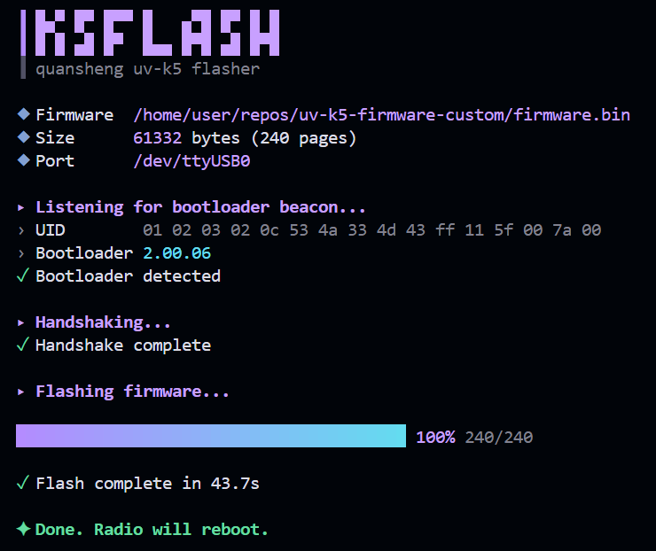

# k5flash

A standalone Python CLI flasher for the **Quansheng UV-K5/K6/UV-5R Plus** radios.

Built because `k5prog` and `k5_fw1 serialtool` couldn't land a handshake.



## Usage

```
python3 k5flash.py /dev/ttyUSB0 firmware.bin
```

## Entering DFU Mode

1. Turn off the radio
2. Hold **PTT**
3. Turn on while holding PTT
4. Wait for the **white LED** (screen stays blank)
5. Flash away

## Requirements

- Python 3
- `pyserial` (`pip install pyserial`)
- A Kenwood 2-pin USB programming cable (FTDI/CH340/CP2102)

## What It Handles

- XOR-obfuscated serial protocol
- CRC-16 XMODEM validation
- Bootloader beacon detection + handshake
- Page-by-page flash with progress bar
- Works with raw `.bin` firmware (not `.packed.bin`)

## Tested With

- Quansheng UV-K5 (bootloader 2.00.06)
- [egzumer custom firmware](https://github.com/egzumer/uv-k5-firmware-custom)
- FTDI FT232 cable on Linux

## License

MIT
